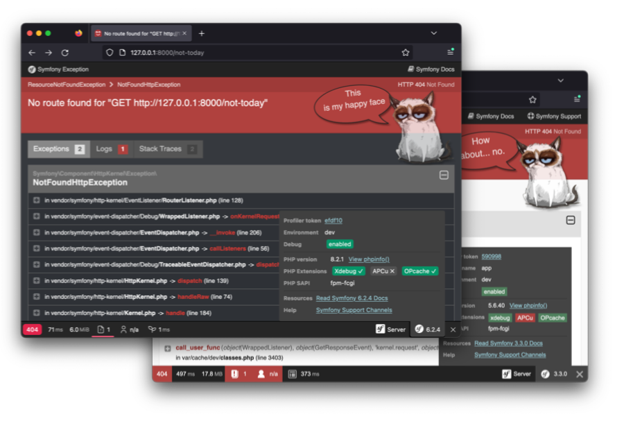

# Grumpy Error Bundle

### What this bundle does?
Your day can always be a bit ~~better~~ more grumpy. This bundle simply adds a well-known and beloved cat to your error
pages. It will ~~greet~~ scoff you in different ways and will not let you pet it - whether you're dreading on a leagy
PHP 5.6 project or playing with a shiny new PHP 8 toy.

### Why and how?!
The idea originated around a decade ago, back in the Symfony 2 days. While we all love the little happy ghost, after 
long hours of debugging of the [mercator projection](https://en.wikipedia.org/wiki/Mercator_projection) calculation code
 the happiness in our team dwindled. So, instead of being productive I decided to add a funny image to our error 
messages... and people wonder why developers are strange. I hope my old dev team doesn't hate me to this day :D 

On the serious note, being nostalgic and going through old photos, I decided to recreate the old hack as a bundle which 
supports a wide range of PHP and Symfony versions, for all of us stuck maintaining ancient projects.

## Requirements

- **PHP**: 5.5+/7.0+/8.0+
- **Symfony**: v3.3 - 6.2+
- *You can adapt it easily to <3.3, but the design of the page changed. If you're a poor soul working with such an old
  version, please create an issue - I will add a version for older Symfony releases.*

## Installation
1. Add package via composer: `composer require noflash/grumpy-error-bundle`
2. If you're you're using Symfony Flex (default since v4.0) you're ready to go. Otherwise, you may need to add the 
   bundle to your configuration:
    - If you have `config/bundles.php`, add `NoFlash\GrumpyError\GrumpyErrorBundle::class => ['all' => true]` there
    - For old directory structure (generally pre-4.0) add `new NoFlash\GrumpyError\GrumpyErrorBundle()` to 
      `app/AppKernel.php` in `$bundles`

## Tested Symfony Versions
Things has changed over the years, but legacy never dies. Thus, this bundle was tested with:

- Symfony 3.3.x on PHP 5.6 & 7.2 ([initial version with new redesign](https://symfony.com/blog/new-in-symfony-3-3-redesigned-exception-pages))
- Symfony 4.1.x on PHP 7.2 ([changed controller call syntax](https://github.com/symfony/symfony/pull/26085))
- Symfony 4.4.x on PHP 7.2 ([changed how overriding exception/error controller is done](https://github.com/symfony/symfony/blob/4.4/UPGRADE-4.4.md#twigbundle))
- Symfony 6.2.x on PHP 8.2 (the newest version at the time of writing)

*Note: For Symfony 4.1, if you're getting an error `The service "web_profiler.controller.profiler" has a dependency on a non-existent service "twig".`
you need to install `symfony/twig-bundle` [due to a Symfony bug](https://github.com/symfony/symfony/issues/28803).*

